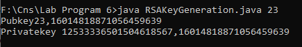
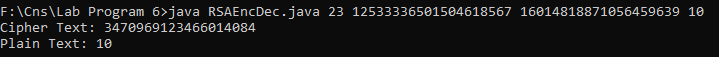

# <center>Lab Program 6</center>
# <center>RSA Algorithm</center>
<hr>
<div style="font-size:20px"><p>(i.)Write an program for RSA Algorithm for generation of public and private keys.</p>
</div>
<div style="font-size:20px"><p>(ii.)Write an program for Encrytion and Decryption.</p>
</div>

### <b>RsaKeyGeneration.java </b>
```java

import java.io.*;
import java.util.*;
import java.math.BigInteger;
import java.lang.*;

class RsaKeyGeneration
{
	public static void main(String args[])
	{
		Random rand1 = new Random(System.currentTimeMillis());
		Random rand2 =new Random (System.currentTimeMillis()*10);
		int pubkey=Integer.parseInt(args[0]);
		BigInteger p = BigInteger.probablePrime(32,rand1);
		BigInteger q = BigInteger.probablePrime(32,rand2);
		BigInteger n = p.multiply(q);
		BigInteger p_1 = p.subtract(new BigInteger("1"));
		BigInteger q_1 = q.subtract(new BigInteger("1"));
		BigInteger p_1_q_1 = p_1.multiply(q_1);
		while(true)
		{
			BigInteger GCD = p_1_q_1.gcd(new BigInteger(""+pubkey));
		        if(GCD.equals(BigInteger.ONE))
		        {
		        break;
		        }
		        pubkey++;
		}
		BigInteger publkey = new BigInteger(""+pubkey);
		BigInteger privkey = publkey.modInverse(p_1_q_1);
		System.out.println("Pubkey"+publkey+","+n);
		System.out.println("Privatekey "+privkey+","+n);
	}
}

```

> OUTPUT : For (i.)
```shell
f:\Cns\Lab Program 6>java RsaKeyGeneration.java 23
Pubkey23,11671911799309982489
Privatekey 9134539663605758471,11671911799309982489
```

### <b>RsaEncDec.java </b>

```java
import java.math.BigInteger;
import java.util.*;

public class RsaEncDec {
    public static void main(String[] args) {
        BigInteger bigB_pubkey = new BigInteger(args[0]);
        BigInteger bigB_prvkey = new BigInteger(args[1]);
        BigInteger bigB_n = new BigInteger(args[2]);

        int asciiVal = Integer.parseInt(args[3]);
        
        BigInteger bigB_val = new BigInteger(""+asciiVal);
        BigInteger bigB_cipherval = bigB_val.modPow(bigB_pubkey,bigB_n);
        
        System.out.println("Cipher Text: "+bigB_cipherval);
        
        BigInteger bigB_plainval = bigB_cipherval.modPow(bigB_prvkey,bigB_n);
        
        int plainVal = bigB_plainval.intValue();
        
        System.out.println("Plain Text: "+plainVal);
    }
}
```

> OUTPUT : For (ii.)
```shell
f:\Cns\Lab Program 6>java RsaEncDec.java 23 9134539663605758471 11671911799309982489 10
Cipher Text: 6731615311380016737
Plain Text: 10
```

<h2>Short description of RSA Algorithm:</h2>
<p>RSA or Rivest–Shamir–Adleman is an algorithm employed by modern computers to encrypt and decrypt messages. It is an asymmetric cryptographic algorithm. Asymmetric means that there are two different keys. This is also called public-key cryptography because one among the keys are often given to anyone. The other is the private key which is kept private. The algorithm is predicated on the very fact that finding the factors of an outsized number is difficult: when the factors are prime numbers, the matter is named prime factorization. It is also a key pair (public and personal key) generator.</p>

#### we can summarize the steps of RSA Algo:-

1. Consider two prime numbers p and q.
2. Compute n = p*q
3. Compute ϕ(n) = (p – 1) * (q – 1)
4. Choose e such gcd(e , ϕ(n) ) = 1
5. Calculate d such e*d mod ϕ(n) = 1
6. Public Key {e,n} Private Key {d,n}
7. Cipher text C = Pe mod n where P = plaintext
8. For Decryption D = Dd mod n where D will refund the plaintext.

_______


##### RsaKeyGeneration.java 
# <center></center>
##### RsaEncDec.java 
# <center></center>

>NOTE: Be aware of passing values in command while execution of program.

